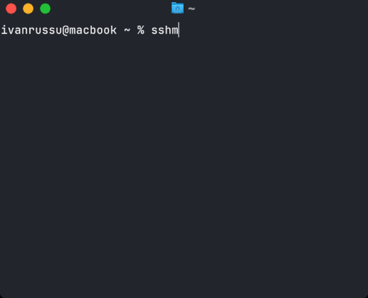

# SSHM – SSH Menu

A tool for interactively selecting an SSH host from your `~/.ssh/config` file.



Did you know that you can use aliases for your SSH credentials and simply type `ssh my-fav-server` instead of `ssh admin@127.0.0.1 -p 2210`?

To do this, you need to create a `~/.ssh/config` file with contents similar to:

```
Host "always down prod"
    HostName 127.0.0.1
    User root
    Port 22

Host my-fav-server
    HostName 127.0.0.1
    User admin
    Port 2210

Host "😎 some cool server"
    HostName 127.0.0.1
    User dude
    Port 2211
```

However, even with this setup, you'll still have to remember all the fancy names you've given to your servers. This simple tool is designed to provide a convenient menu of your hosts.

## Installation

### Prebuilt Binaries

Simply download the binary from the latest release.

### From Source

Assuming you're in the project's root directory:

```bash
go build .
```

If you're on macOS:

```bash
mv ./sshm /usr/local/bin/sshm
```

If you're on Linux:

```bash
sudo mv ./sshm /usr/bin
```

## Usage

Just run the program and select the desired host.

```bash
sshm
```

You can navigate up and down using the arrow keys or the `j` and `k` keys.

To filter results, type `/` followed by your search term.

# Preparing release

Execute `./build.sh` which will build sshm for several platforms in `./dist` directory.
